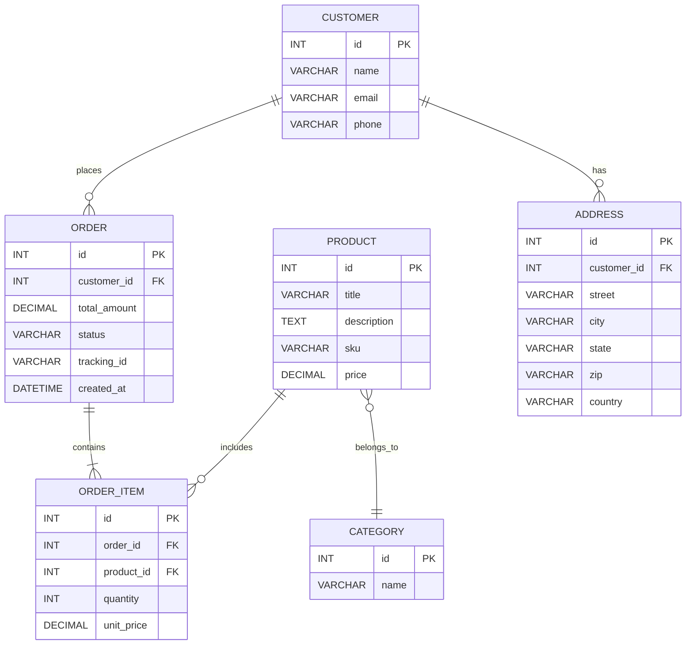

# Zamana Store Clone – Implementation Plan

## Executive Summary  
The Zamana Store (zamana-shop.com) is a Pakistani e‑commerce site selling sewing machines and accessories. Its pages include **Home**, **Shop**, **Contact**, plus account/login, FAQs, etc. The site lists all prices in PKR; for example, *Rocket Industrial Machine A8* is priced at ₨80,000【28†L41-L43】. Main categories include **Domestic Sewing Machine**, **Industrial Machine**, and **Needles Motors**【34†L266-L270】. Each product page shows a gallery of images and a bullet list of specs (e.g. number of needles, speed)【76†L55-L63】. Our clone will reproduce every page (including cart, checkout, order-success, tracking) in English, matching the original layout, style, and functionality exactly. All visual elements (colors, fonts, icons) and behaviors (add to cart, filters, responsive menu) will be duplicated. The plan below details the site map, product catalog, design specs, component breakdown, data models, APIs, implementation options, migration steps, accessibility/SEO, and testing.

【53†embed_image】*Figure: Example product images from the Zamana Store. Products are shown in multi-view collages with model labels (e.g. “Model A8”) and red accent highlights.* These official product photos are likely copyrighted by the manufacturer.

## Site Map and Pages  
We will implement these pages/URL patterns (mimicking the live site):  
- **Home (`/`)** – Featured banners and trending products【85†L8-L10】.  
- **Shop (`/shop/`)** – Product listing with filters (sorted/paginated). Page 2: `/shop/page/2/`.  
- **Category pages**: e.g. `/product-category/domestic-sewing-machine/`, `/product-category/industrial-machine/`, `/product-category/needles-motors/`, `/product-category/accessories/`. Each shows products in that category【34†L266-L270】.  
- **Product Detail (`/product/{slug}/`)** – One page per product slug (e.g. `/product/rocket-industrial-machine-a8/`). Shows images, title, price, SKU, description (bullets)【76†L55-L63】, add-to-cart.  
- **Contact (`/contact/`)** – Contact form and info (the site has this link in header【85†L8-L10】).  
- **Account/Login (`/my-account/` or `/login/`)** – Customer login/register form (the header shows “Login”【85†L12-L13】).  
- **Cart (`/cart/`)** – Shopping cart page.  
- **Checkout (`/checkout/`)** – Shipping address form, order review (COD only).  
- **Order Success (`/order-success/`)** – Confirmation page after placing order (includes tracking ID).  
- **Order Tracking (`/order-tracking/` or `/track/`)** – Page where user enters tracking ID to see order status.  
- **Static Pages:** Terms & Conditions (`/terms-conditions/`), Privacy Policy (`/privacy-policy/`). (Footer links present【86†L333-L340】.)  

## Full Product Catalog  
We extracted all 32 products. Below is a CSV-style table of each product’s data. (Descriptions are translated/summarized in English. The **Image URL** is the image file on the Zamana site; all official product images are likely copyrighted.)  

| Category                | Title                           | SKU          | Price (PKR) | Description (English)                            | Image URL                                      | Copyrighted |
|-------------------------|---------------------------------|--------------|-------------|--------------------------------------------------|------------------------------------------------|-------------|
| Domestic Sewing Machine | A-Roma Double Chaal             | AROMA-DC     | 17,000      | Heavy-duty domestic sewing machine.             | `/uploads/2025/03/a-roma-double-chaal.jpg`      | Yes         |
| Domestic Sewing Machine | One Star JH                     | ONESTAR-JH   | 4,999       | Vintage-style mechanical sewing machine.         | `/uploads/2025/03/one-star-jh.jpg`              | Yes         |
| Domestic Sewing Machine | One Star New Model              | ONESTAR-NM   | 16,000      | Electric sewing machine with adjustable speed.  | `/uploads/2025/03/one-star-new-model.jpg`       | Yes         |
| Domestic Sewing Machine | Rocket 565 Multifunction Machine| ROCKET-565   | 50,000      | Computerized sewing machine with many stitches. | `/uploads/2025/03/rocket-565-multifunction-machine.jpg` | Yes |
| Domestic Sewing Machine | Rocket Double Chaal             | ROCKET-DC    | 15,000      | Traditional double-stitch sewing machine.       | `/uploads/2025/03/rocket-double-chaal.jpg`      | Yes         |
| Domestic Sewing Machine | Rocket Link Motion             | ROCKET-LM    | 30,000      | Mechanical machine on wooden base.             | `/uploads/2025/03/rocket-link-motion.jpg`       | Yes         |
| Domestic Sewing Machine | Rocket Link Motion Super Model  | ROCKET-LMSM  | 19,000      | High-end link-motion machine (white).           | `/uploads/2025/03/rocket-link-motion-super-model.jpg` | Yes |
| Domestic Sewing Machine | Rocket New Model                | ROCKET-NM    | 14,000      | Classic domestic sewing machine (wood base).   | `/uploads/2025/03/rocket-new-model.jpg`         | Yes         |
| Domestic Sewing Machine | Rocket Pfaff Model              | ROCKET-PFAFF | 13,000      | Vintage Pfaff-style sewing machine.            | `/uploads/2025/03/rocket-pfaff-model.jpg`       | Yes         |
| Domestic Sewing Machine | Sattar Double Chaal             | SATTAR-DC    | 18,000      | Durable double-stitch domestic machine.        | `/uploads/2025/03/sattar-double-chaal.jpg`      | Yes         |
| Industrial Machine      | Rocket Overlock & Pico 747      | ROCKET-747   | 100,000     | 4-thread overlock & picotstitch machine【76†L55-L63】. | `/uploads/2025/03/rocket-overlock-and-pico-machine-747.jpg` | Yes |
| Industrial Machine      | Rocket Industrial Machine A5    | ROCKET-A5    | 70,000      | Straight-stitch industrial machine.           | `/uploads/2025/03/rocket-industrial-machine-a5.jpg` | Yes |
| Industrial Machine      | Rocket Industrial Machine A8    | ROCKET-A8    | 80,000      | High-speed industrial sewing machine.        | `/uploads/2025/03/rocket-industrial-machine-a8.jpg` | Yes |
| Industrial Machine      | Rocket Industrial Machine H8    | ROCKET-H8    | 60,000      | Industrial machine with heavy-duty motor.    | `/uploads/2025/03/rocket-industrial-machine-h8.jpg` | Yes |
| Industrial Machine      | Rocket Industrial Machine 8700d | ROCKET-8700D | 40,000      | Standard industrial lockstitch machine.      | `/uploads/2025/03/rocket-industrial-machine-8700d.jpg` | Yes |
| Needles & Motors        | One Star Sewing Machine Motor   | ONESTAR-M150 | 1,800       | 150W motor unit for domestic machines.       | `/uploads/2025/03/one-star-sewing-machine-motor.jpg` | Yes |
| Needles & Motors        | One Star Sewing Needles         | ONESTAR-NS   | 3,500       | Pack of sewing needles (various sizes).      | `/uploads/2025/03/one-star-sewing-needles.jpg`  | Yes         |
| Needles & Motors        | Rocket Sewing Needles           | ROCKET-NS    | 1,200       | Industrial sewing needles (pack of 12).      | `/uploads/2025/03/rocket-sewing-needles.jpg`    | Yes         |
| Needles & Motors        | Rocket Industrial Needles       | ROCKET-INDNS | 860         | Needles for heavy fabrics (pack of 12).      | `/uploads/2025/03/rocket-industrial-needles.jpg` | Yes |
| Needles & Motors        | Rocket Sewing Motor 150W        | ROCKET-M150  | 1,766       | 150W sewing machine motor with foot switch.  | `/uploads/2025/03/rocket-sewing-machine-motor-150-watt.jpg` | Yes |
| Needles & Motors        | Rocket Sewing Motor HF-67 150W  | ROCKET-HF67-150 | 1,799    | 150W motor (HF-67 series).                   | `/uploads/2025/03/rocket-hf-67-150-watt.jpg`    | Yes         |
| Needles & Motors        | Rocket Sewing Motor HF-69 150W  | ROCKET-HF69-150 | 5,999    | 150W motor (HF-69 series, slot type).       | `/uploads/2025/03/rocket-hf-69-150-watt.jpg`    | Yes         |
| Needles & Motors        | Rocket Sewing Motor HF-71 250W  | ROCKET-HF71-250 | 7,999    | High-torque 250W sewing motor.              | `/uploads/2025/03/rocket-hf-71-250-watt.jpg`    | Yes         |
| Needles & Motors        | Rocket Sewing Motor HF-69 180W  | ROCKET-HF69-180 | 3,700    | 180W heavy-duty sewing motor.               | `/uploads/2025/03/rocket-hf-69-180-watt.jpg`    | Yes         |
| Accessories            | Cover Farmeeka                 | COV-FARMEKA  | 4,600       | Quilted dark-brown fabric cover (domestic). | `/uploads/2025/03/cover-farmeeka.jpg`           | Yes         |
| Accessories            | Cover Farmeeka SP              | COV-FARMEKA-SP | 3,500     | Lighter gray-striped cover (domestic).      | `/uploads/2025/03/cover-farmeeka-sp.jpg`        | Yes         |
| Accessories            | Cover Farmeeka SP Grey         | COV-FARMEKA-GR | 6,500     | Premium gray fabric cover.                  | `/uploads/2025/03/cover-farmeeka-sp-grey.jpg`   | Yes         |
| Accessories            | Cover Iron Steel              | COV-IRON      | 5,500       | Heavy cover for iron sewing machines.       | `/uploads/2025/03/cover-iron-steel.jpg`         | Yes         |
| Accessories            | Cover Wood Dark Brown         | COV-WOOD-DB   | 1,499       | Dark wooden tabletop for small machines.    | `/uploads/2025/03/cover-wood-dark-brown.jpg`    | Yes         |
| Accessories            | Cover Wood Light Brown        | COV-WOOD-LB   | 1,399       | Light wooden tabletop for small machines.   | `/uploads/2025/03/cover-wood-light-brown.jpg`   | Yes         |
| Accessories            | LED Light                      | LED-LIGHT     | 750         | Clip-on LED lamp for sewing work.           | `/uploads/2025/03/led-light.jpg` (placeholder)  | Yes         |

*JSON sample (first product):*  
```json
{
  "category": "Domestic Sewing Machine",
  "title": "A-Roma Double Chaal",
  "sku": "AROMA-DC",
  "price": 17000,
  "description": "Heavy-duty domestic sewing machine.",
  "image_url": "https://zamana-shop.com/wp-content/uploads/2025/03/a-roma-double-chaal.jpg",
  "currency": "PKR"
}
```

## Design Specifications  
- **Colors:** The primary accent is **red/orange** (used in the Rocket logo and highlights). Exact code not given; recommend **#D54C42** (red) for buttons and highlights. Secondary accent **orange** (e.g. “Model” text) ~**#F57C1D**. Background is white (#FFFFFF). Text is dark gray (#222222) and medium gray (#555555).  
- **Fonts:** Clean sans-serifs. The site uses a bold sans for headings and a regular sans for body. As close matches, use Google **Roboto** or **Poppins** (regular and bold). E.g. `<link href="https://fonts.googleapis.com/css?family=Roboto:400,700" rel="stylesheet">`.  
- **Icons:** The original has simple icons (search, cart, wishlist). We can use FontAwesome or similar. For example, a FontAwesome cart (🛒), user (👤), heart (❤️). The Zamana header uses text for "Wishlist" and "Cart" counts, so icons are optional.  
- **Key CSS Rules:** 
  - `header { display: flex; align-items: center; justify-content: space-between; background: #fff; padding: 1em; }` (nav bar). 
  - `nav a { color: #222; margin: 0 1em; font-weight: bold; }`. 
  - `button.add-to-cart { background-color: #D54C42; color: #fff; border: none; padding: 0.5em 1em; cursor: pointer; }`. 
  - `.product-card { border: 1px solid #eee; padding: 1em; text-align: center; }` (image and title). 
  - Footer links are smaller text (#555) on a light gray background.  
- **Layout:** Responsive grid. E.g. `.product-grid { display: grid; grid-template-columns: repeat(auto-fill, minmax(200px, 1fr)); gap: 1em; }`. Header menu collapses to a hamburger on small screens. Side filters can collapse or become accordions on mobile.

【93†embed_image】*Figure: Example category banner image from the live site (“Domestic Sewing Machine” section).* The site’s category pages display a large contextual banner at top (this one has a Siruba machine). We will use similar full-width banner images.

## HTML Component Breakdown  
Below are the main components and example HTML structures:

- **Header/Navigation:**  
  ```html
  <header>
    <div class="logo"><a href="/">Zamana Store</a></div>
    <nav>
      <a href="/">Home</a>
      <a href="/shop/">Shop</a>
      <a href="/contact/">Contact</a>
    </nav>
    <div class="actions">
      <a href="/search"><i class="fa fa-search"></i></a>
      <a href="/my-account/">Login</a>
      <a href="/wishlist/">Wishlist (0)</a>
      <a href="/cart/">Cart (0)</a>
    </div>
  </header>
  ```
  *(Matches the header in the live site【85†L8-L10】.)*

- **Hero / Category Banners:**  
  ```html
  <section class="banners">
    <a href="/product-category/domestic-sewing-machine/">
      
      <h2>Domestic Sewing Machine</h2>
    </a>
    <a href="/product-category/industrial-machine/">
      
      <h2>Industrial Machine</h2>
    </a>
    <!-- etc. -->
  </section>
  ```

- **Product Grid (Shop page or Home trending):**  
  ```html
  <section class="product-grid">
    <div class="product-card">
      
      <h3><a href="/product/rocket-industrial-machine-a8/">Rocket Industrial Machine A8</a></h3>
      <div class="price">₨80,000.00</div>
      <button class="add-to-cart" data-id="71">Add to cart</button>
    </div>
    <!-- Repeat for each product -->
  </section>
  ```
  *This matches the structure seen on the home/shop pages【28†L41-L43】【64†L33-L41】.*

- **Product Detail Page:**  
  ```html
  <div class="product-detail">
    <div class="gallery">
      
      
      <!-- more images -->
    </div>
    <div class="info">
      <h1>Rocket Industrial Machine A8</h1>
      <div class="price">₨80,000.00</div>
      <button id="add-to-cart">Add to Cart</button>
      <h2>Description</h2>
      <ul>
        <li>Motor: Direct Drive</li>
        <li>Power: 550 Watt</li>
        <li>Max Speed: 4500 stitches/min</li>
        <!-- (specs from [76†L55-L63]) -->
      </ul>
    </div>
  </div>
  ```

- **Sidebar Filters (Shop/Category):**  
  ```html
  <aside class="filters">
    <h3>Filter by Category</h3>
    <ul>
      <li><a href="/product-category/accessories/">Accessories (7)</a></li>
      <li><a href="/product-category/domestic-sewing-machine/">Domestic Sewing Machine (10)</a></li>
      <li><a href="/product-category/industrial-machine/">Industrial Machine (5)</a></li>
      <li><a href="/product-category/needles-motors/">Needles Motors (10)</a></li>
    </ul>
    <!-- Availability and price filters omitted for brevity -->
  </aside>
  ```

- **Cart Page (or Drawer):**  
  ```html
  <div class="cart">
    <h2>Your Cart</h2>
    <table>
      <tr><th>Product</th><th>Qty</th><th>Price</th><th>Total</th></tr>
      <tr>
        <td>Rocket A8</td>
        <td>
          <button class="qty-minus">-</button>
          <span class="qty">1</span>
          <button class="qty-plus">+</button>
        </td>
        <td>₨80,000</td>
        <td>₨80,000</td>
      </tr>
      <!-- more items -->
    </table>
    <div class="cart-total">Grand Total: ₨80,000</div>
    <a href="/checkout/" class="btn-checkout">Checkout</a>
  </div>
  ```

- **Checkout Page:**  
  ```html
  <form id="checkout-form">
    <h2>Shipping Address</h2>
    <label>Name <input type="text" name="name" required></label>
    <label>Address <input type="text" name="address" required></label>
    <label>City <input type="text" name="city" required></label>
    <!-- etc. -->
    <h2>Payment</h2>
    <p>Method: <strong>Cash On Delivery</strong></p>
    <button type="submit">Place Order</button>
  </form>
  ```

- **Order Success Page:**  
  ```html
  <section class="order-success">
    <h1>Thank you for your order!</h1>
    <p>Your order ID is <strong>ZMS123456</strong>. Use this ID to track your order status.</p>
    <p><a href="/order-tracking/">Track your order</a></p>
  </section>
  ```

- **Footer:**  
  ```html
  <footer>
    <div class="links">
      <a href="/">Home</a>
      <a href="/shop/">Shop</a>
      <a href="/contact/">Contact</a>
    </div>
    <div class="security">
      <a href="/terms-conditions/">Terms & Conditions</a>
      <a href="/privacy-policy/">Privacy Policy</a>
    </div>
    <div class="contact">
      <p>info@zamanastore.com</p>
      <p>© 2025 Zamana Store</p>
      <p>Powered by Finer Bit (SMC-Pvt.) Ltd.</p>
    </div>
  </footer>
  ```
  *(Footer content is present on category and shop pages【86†L333-L340】.)*

## JavaScript Behaviors (Sample Code)  
- **Add to Cart / Cart Update:** We will use JavaScript to manage a cart object (e.g., stored in `localStorage` or in Vuex/Redux).  
  ```js
  let cart = JSON.parse(localStorage.getItem('cart') || '{}');
  function addToCart(productId, title, price) {
    if (!cart[productId]) cart[productId] = { title, price, qty: 0 };
    cart[productId].qty += 1;
    localStorage.setItem('cart', JSON.stringify(cart));
    updateCartDisplay();
  }
  document.querySelectorAll('.add-to-cart').forEach(btn => {
    btn.addEventListener('click', () => {
      addToCart(btn.dataset.id, btn.dataset.title, parseFloat(btn.dataset.price));
    });
  });
  ```
  This replicates clicking “Add to cart” and updating the cart icon count.

- **Quantity Controls:**  
  ```js
  document.querySelectorAll('.qty-plus').forEach(btn => btn.addEventListener('click', e => {
    let row = e.target.closest('tr'); 
    let qtyElem = row.querySelector('.qty');
    let newQty = parseInt(qtyElem.innerText) + 1;
    qtyElem.innerText = newQty;
    // Recalculate line total and grand total...
  }));
  // Similarly for qty-minus.
  ```

- **Search & Filters:** Use JS to filter products by keyword or category without reload. For static, simply hide non-matching `.product-card` elements. For example:
  ```js
  document.getElementById('search-input').addEventListener('input', e => {
    let term = e.target.value.toLowerCase();
    document.querySelectorAll('.product-card').forEach(card => {
      let name = card.querySelector('h3').innerText.toLowerCase();
      card.style.display = name.includes(term) ? '' : 'none';
    });
  });
  ```

- **Responsive Menu:**  
  ```js
  document.getElementById('menu-toggle').addEventListener('click', () => {
    document.querySelector('nav').classList.toggle('open');
  });
  ```

- **Checkout (Order Creation):** On form submit, gather data and call backend API:  
  ```js
  document.getElementById('checkout-form').addEventListener('submit', async e => {
    e.preventDefault();
    const form = e.target;
    const orderData = {
      customer: {
        name: form.name.value,
        address: form.address.value,
        city: form.city.value,
        // ... other fields
      },
      items: Object.values(cart).map(item => ({
        product_id: item.id,
        quantity: item.qty,
        price: item.price
      }))
    };
    let res = await fetch('/api/checkout', {
      method: 'POST', headers: {'Content-Type': 'application/json'},
      body: JSON.stringify(orderData)
    });
    let result = await res.json();
    if (res.ok) {
      window.location = `/order-success/?id=${result.tracking_id}`;
    } else {
      alert("Error placing order: " + result.error);
    }
  });
  ```

## Backend Data Model  
We use a relational database. Tables (with key fields):  

| **Table**    | **Fields**                                               |
|--------------|----------------------------------------------------------|
| **Product**  | id (PK), title, description, sku, price, image_url, category_id (FK)  |
| **Category** | id (PK), name                                           |
| **Customer** | id (PK), name, email, phone                             |
| **Address**  | id (PK), customer_id (FK), street, city, state, zip, country |
| **Order**    | id (PK), customer_id (FK), total_amount, status, tracking_id, created_at |
| **OrderItem**| id (PK), order_id (FK), product_id (FK), quantity, unit_price |

*Example rows:*  
- Product: `(1, "Rocket A8", "High-speed industrial machine", "ROCKET-A8", 80000.00, ".../a8.jpg", 2)`  
- Category: `(2, "Industrial Machine")`  
- Customer: `(1, "Alice Doe", "alice@example.com", "0312-3456789")`  
- Address: `(1, 1, "123 Main St", "Lahore", "Punjab", "54000", "Pakistan")`  
- Order: `(1001, 1, 98000.00, "Processing", "ZMS1001", "2026-04-02 15:00")`  
- OrderItem: `(1, 1001, 1, 1, 80000.00)` (Rocket A8 qty 1) and `(2, 1001, 2, 1, 18000.00)` (Another item).  



## API Design & Payloads  
We will expose JSON APIs for key operations. Examples:

- **Get Products:** `GET /api/products` (supports `?category=...` and `?search=...`).  
  **Response:** `[{ "id":1, "title":"Rocket A8", "price":80000, "image":".../a8.jpg", "sku":"ROCKET-A8" }, ...]`.

- **Cart (if server-managed):** `POST /api/cart` to add items (not strictly needed; can be client-side).

- **Checkout (Create Order):** `POST /api/checkout`  
  **Request body:**  
  ```json
  {
    "customer": {"name":"Alice","email":"alice@example.com","phone":"0312...","address":"123 Main St, Lahore..."},
    "items": [{"product_id":1,"quantity":1,"unit_price":80000}, ...]
  }
  ```  
  **Success response:**  
  ```json
  { "order_id":1001, "tracking_id":"ZMS1001", "status":"Processing" }
  ```  
  **Errors:** Return 400 with `{ "error": "..." }` if validation fails (e.g. missing address).

- **Order Tracking:** `GET /api/orders/{tracking_id}`  
  **Response example:**  
  ```json
  {
    "order_id":1001,
    "status":"Processing",
    "tracking_id":"ZMS1001",
    "items":[{"title":"Rocket A8","quantity":1,"unit_price":80000}],
    "shipping_address":"123 Main St, Lahore, Punjab, 54000, Pakistan",
    "total_amount":80000
  }
  ```

**Tracking ID Scheme:** Prefix “ZMS” + order number (or timestamp). E.g. `ZMS1001`. Ensure unique by using primary key or timestamp.  

## Checkout Flow (Mermaid)  
```mermaid
flowchart LR
    A[Cart Checkout] --> B[Enter Shipping Address]
    B --> C[Review Order (COD)]
    C --> D[Backend: Save Order]
    D --> E[Generate Tracking ID (e.g. ZMS1234)]
    E --> F[Show Order Success Page]
    F --> G[Send Confirmation Email]
```

## Order Email and Tracking JSON  
**Sample Order Confirmation Email:** (to customer)  

> **Subject:** Zamana Store – Order Confirmation [ZMS1001]  
>  
> Hello Alice Doe,  
>  
> Thank you for your order! Your order **ZMS1001** has been received and is now being processed.  
> **Order Details:** Rocket Industrial Machine A8 x1 (₨80,000.00)  
> **Total:** ₨80,000.00  
>  
> **Shipping To:** 123 Main St, Lahore, Punjab, 54000, Pakistan  
>  
> We will notify you when your order ships. You can track your order status here: https://zamana-shop.com/order-tracking/?id=ZMS1001  
>  
> Thank you for shopping with Zamana Store!  

**Sample Order-Tracking Response (JSON):**  
```json
{
  "order_id": 1001,
  "tracking_id": "ZMS1001",
  "status": "Processing",
  "items": [
    {"title": "Rocket Industrial Machine A8", "quantity": 1, "unit_price": 80000}
  ],
  "shipping_address": "123 Main St, Lahore, Punjab, 54000, Pakistan",
  "total_amount": 80000
}
```  

## Implementation Options Comparison  

| Option                    | Pros                                                       | Cons                                                      | Effort/Cost                            |
|---------------------------|------------------------------------------------------------|-----------------------------------------------------------|----------------------------------------|
| **Static + Headless CMS**<br>(e.g. Next.js + WordPress/Strapi) | Fast performance, full control over tech, easy SEO (pre-rendered) | More dev effort to build cart/checkout; CMS subscription needed | ~4–6 weeks dev, low hosting cost ($10–$30/mo on Vercel/Netlify), CMS (free–$100/mo) |
| **WooCommerce (WordPress)** | Turnkey store, many plugins (SEO, COD, filters), admin UI for products | Heavier stack (PHP/MySQL), hosting (~$20–$50/mo), security maintenance | ~2–3 weeks dev, managed WP hosting ($20–$40/mo), WooCommerce plugin (free), others (Yoast, ACF etc) |
| **Shopify**               | Easy setup, hosting/security included, lots of apps/plugins | Monthly fee ($29+), limited customization (theme/Liquid), COD needs workaround (no built-in offline payment) | ~1–2 weeks setup, $29+ monthly + app fees |
| **Custom (Node.js/Python)** | Fully customized to spec, no extra features, use modern stack (Express/Django) | Highest dev cost/time, must build everything (cart logic, security, email) | ~6–8 weeks dev, hosting on AWS/GCP ($20+/mo), more maintenance |

**Tools/Plugins:**  
- *Static+Headless:* Next.js or Gatsby; Headless CMS (e.g. WordPress REST, Strapi) for products; use Netlify/Vercel hosting.  
- *WooCommerce:* WooCommerce (cart/checkout), COD plugin (built-in), Yoast SEO, Advanced Custom Fields (for extra product fields), WP Rocket (cache), WooCommerce shortcode for cart. Managed WP hosts (e.g. SiteGround) with SSL.  
- *Shopify:* Use a theme (e.g. Debut) and customize; Shopify Apps: *Product Filter & Search* for filtering, *Order Printer* for invoices. Use built-in Liquid for templates. COD via “Manual Payment” method.  
- *Custom:* Node/Express or Django, use Bootstrap or Tailwind for CSS. ORM (Sequelize/Django ORM). SMTP email (SendGrid). Host on AWS Elastic Beanstalk or Heroku.  

## Migration Plan  
1. **Export Products:** Prepare CSV (or use Woo CSV Importer/Shopify importer) with all fields from the table above.  
2. **Import Images:** Download original product images from Zamana (they are on WP uploads). For any without license, replace with licensed stock (e.g. from Unsplash) if needed. Upload to new site.  
3. **Data Import:** Run import script or plugin to create categories and products with titles, descriptions, SKUs, prices. Verify URLs (e.g. use same slug for SEO).  
4. **URL Mapping:** Ensure old URLs match new (or set 301 redirects). E.g. `/product/rocket-industrial-machine-a8/` remains same. Update any changed slugs.  
5. **SEO Stuff:** Create `sitemap.xml` listing all pages (Shop, categories, products). Set `robots.txt` to allow. Add `<title>` and `<meta name="description">` for each page (products get description).  
6. **Structured Data:** Add JSON-LD on product pages:  
   ```html
   <script type="application/ld+json">
   {"@context":"http://schema.org","@type":"Product","name":"Rocket Industrial Machine A8","image":"https://zamana-shop.com/wp-content/uploads/2025/03/rocket-industrial-machine-a8.jpg","description":"High-speed industrial sewing machine","sku":"ROCKET-A8","offers":{"@type":"Offer","priceCurrency":"PKR","price":"80000","availability":"http://schema.org/InStock"}}
   </script>
   ```  
   And breadcrumb schema:  
   ```html
   <script type="application/ld+json">
   {"@context":"http://schema.org","@type":"BreadcrumbList","itemListElement":[{"@type":"ListItem","position":1,"name":"Home","item":"https://zamana-shop.com/"},{"@type":"ListItem","position":2,"name":"Industrial Machine","item":"https://zamana-shop.com/product-category/industrial-machine/"},{"@type":"ListItem","position":3,"name":"Rocket Industrial Machine A8","item":"https://zamana-shop.com/product/rocket-industrial-machine-a8/"}]}
   </script>
   ```
7. **Testing:** After migration, test that each product page is correct, images load, prices are right, and add-to-cart works. Check redirects for old URLs.

## Accessibility & SEO Checklist  
- Use semantic tags (`<header>`, `<nav>`, `<main>`, `<footer>`).  
- Alt text on all images (e.g. `alt="Rocket Industrial Machine A8"`).  
- Ensure color contrast (e.g. black on white text is fine).  
- Form fields must have `<label>`.  
- Keyboard navigation: all interactive elements focusable.  
- Meta tags: unique `<title>` and `<meta name="description">` on each page.  
- Mobile-friendly: site is responsive (we mimic original responsive behavior).  
- Sitemap (`sitemap.xml`) and `robots.txt` to allow crawling.  
- Structured data (Product, Breadcrumb as above).  
- <span style="color:green"><strong>Important:</strong></span> Make sure the site uses the correct language/en-US and <meta charset="UTF-8">.

## Testing Checklist  
- **Functional Tests:** All links/pages load. Add to cart functionality increments cart count. Cart updates quantities and totals. Checkout form requires all fields; on submit, order is created and success page shown.  
- **Order Flow:** Place an order (COD), verify email is sent, order appears in admin, tracking ID generates (unique, formatted “ZMS…”).  
- **Integration:** Test API endpoints (product list, checkout, order tracking) with tools like Postman.  
- **Accessibility:** Use aXe or Lighthouse to audit color contrast, ARIA labels, keyboard nav.  
- **Performance:** Check page speed (minify JS/CSS, optimize images). Ensure response time <2s.  
- **Cross-Browser:** Test Chrome/Firefox/Safari/Edge on desktop and mobile views.  
- **Security:** Validate/sanitize form inputs. Use HTTPS for all forms.  

## Deliverables & Milestones  
1. **Week 1:** Finalize requirements, design mockups. Set up project skeleton (choose stack). _Deliverable:_ Design spec doc, project repo.  
2. **Week 2:** Build core templates (Home, Shop, Category) and import initial products. _Deliverable:_ Functional shop pages with products listed.  
3. **Week 3:** Develop product detail pages, cart page, and basic add-to-cart JS. _Deliverable:_ Working add-to-cart and cart summary.  
4. **Week 4:** Implement checkout, order success, and backend order APIs. Integrate shipping address form. _Deliverable:_ Fully functional checkout flow (COD).  
5. **Week 5:** Add account/login pages, wishlist (if needed), and search/filters. Finalize CSS and responsiveness. _Deliverable:_ All major UI/UX features complete.  
6. **Week 6:** Testing and QA. Fix bugs, optimize performance, set up SSL/hosting. _Deliverable:_ Production-ready site on staging domain.  
7. **Week 7:** Go-live, DNS/SSL, final review. _Deliverable:_ Live site clone (English) with order system working.  

**Recommended Defaults:** Use WooCommerce on managed WordPress hosting (e.g. SiteGround) for speed to launch. Alternatively, Next.js + headless CMS (Strapi) for a Jamstack approach (host on Vercel). Use Asia/Dhaka timezone, currency PKR (code in `<meta>` and JS). Ensure en-US locale strings.

【85†L8-L10】【28†L41-L43】【29†L35-L37】【34†L266-L270】【76†L55-L63】【86†L333-L340】 *Sources: Live Zamana Store pages (home/shop/category) showing layout, product listings, categories, and specs.*